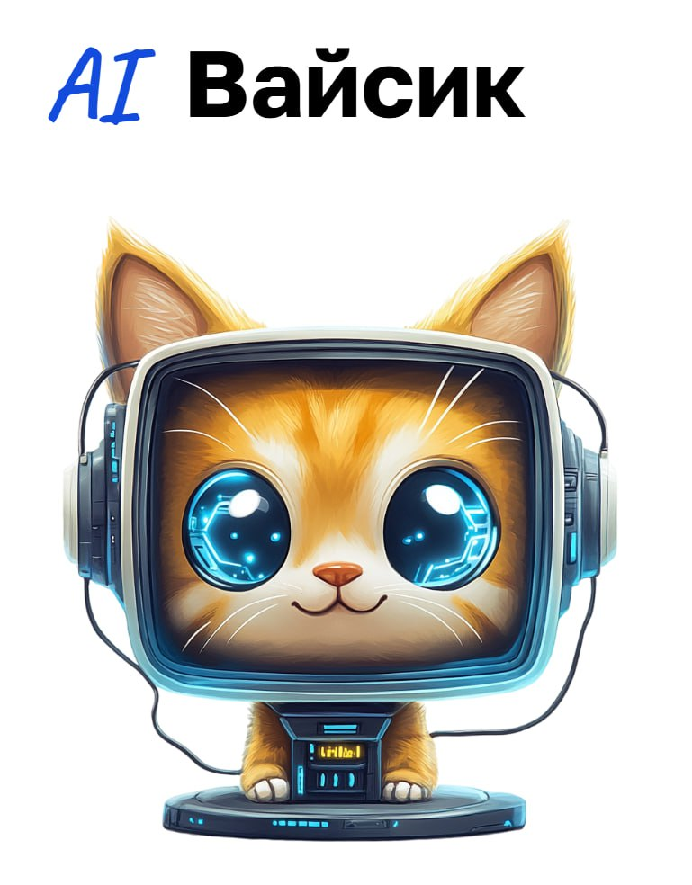

# AI поисковая система и QnA бот по библиотеке знаний 

[](https://hub.docker.com/r/airndlab/perplexica-frontend)
[](https://hub.docker.com/r/airndlab/perplexica-backend)
[](https://hub.docker.com/r/airndlab/mediawise-rag)

Решение команды **НейроДрайв**
по [кейсу](docs/media-wise.pdf) созданию поисковая система и чат-бот по библиотеке знаний медийного агентства
[Media Wise](https://mediadirectiongroup.ru/agency/mediawise/)
на хакатоне Цифровой прорыв сезон: ИИ.


## Описание задачи
В рамках хакатона мы разработали гибридную ИИ-поисковую систему для маркетингового агентства, направленное на повышение эффективности стратегий за счет анализа данных и оптимизации работы с контентом. Цель — автоматизация поиска, обработки информации и построение рекомендаций, основанных на накопленных материалах и данных заказчика.

## Архитектура

### 1. **vllm**
- **Задача:** Обработка запросов на основе модели `Qwen2.5-14B-Instruct-GPTQ-Int4`.
- **Технологии:** vllm с поддержкой GPU для быстрой обработки запросов.
- **Детали:**
    - Модель загружается с сервиса Hugging Face.
    - Используется с квантованием GPTQ для повышения производительности на GPU.
    - Для haystack используется генератор openai - но запросы отправляются в локальный vllm 

### 2. **AI поисковый сервис и QnA**
- **Задача:** Обеспечивает обработку вопросов и генерацию данных с использованием LLM
- **Технологии:** Python, FastAPI.

### 3. **Интерфейс**
- **Задача:** Обеспечивает интерфейс общения с пользователями
- **Технологии:** Perplexica, React.
- **Детали:**
    - Основной интерфейс на основе fork [Perplexica](https://github.com/airndlab/Perplexica).
    - Ведение и хранение диалогов
    - Загрузка документов в s3 совместимое хранилище

### 4. **Просмотр базы знаний и аналитика**
- **Задача:** Предоставляет интерфейс для аналитики
- **Технологии:** Metabase.
- **Детали:**
    - Используется для анализа запросов и улучшения работы поисковой системы

## [Описание RAG-пайплайна](rag/pipline/pipeline.ipynb)

## Стек технологий
- **Интерфейс:** `Perplexica`
- **Языки программирования:** `Python`, `JavaScript`.
- **Базы данных:** `SQLite`, `Metabase`, `s3`.
- **RAG-пайплайны:** `Haystack`.
- **Модели ИИ:** `Qwen2.5-14B-Instruct-GPTQ-Int4`.
- **Инфраструктура:** `Docker Compose`, `vLLM`


## Установка

Для запуска проекта на локальной машине необходимо:
1. Убедиться, что установлен Docker и docker-compose.
2. Настроить файл `.env` с необходимыми переменными окружения.
3. Выполнить команду:
   ```bash
   docker-compose up
   ```
## Сборка

```
docker build -t <название вашего образа>:<тег вашего образа> .
```