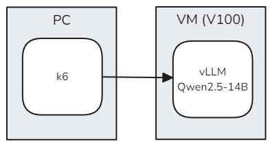
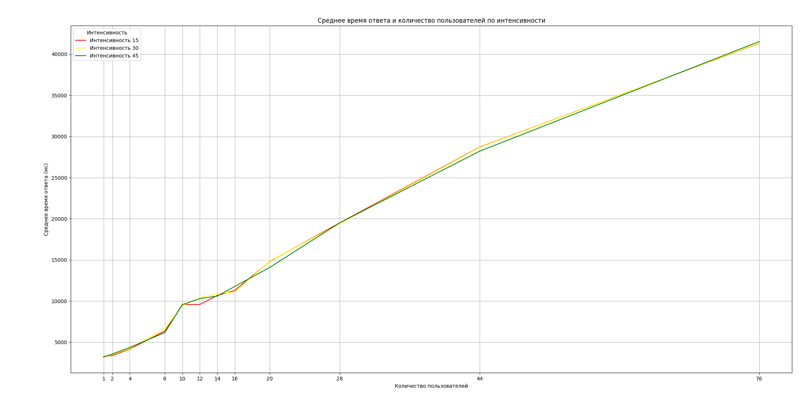
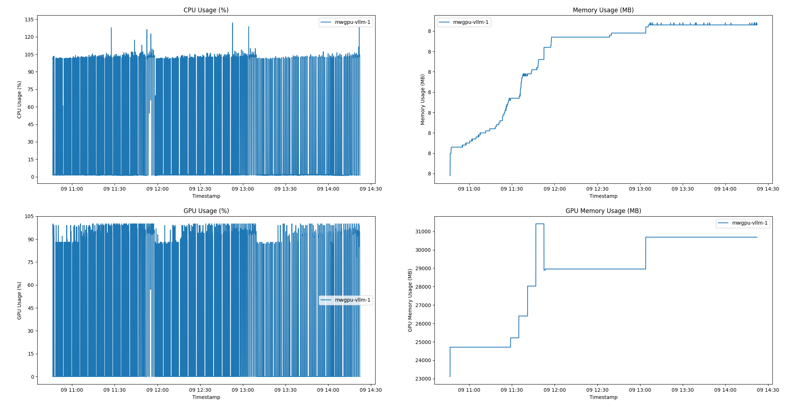
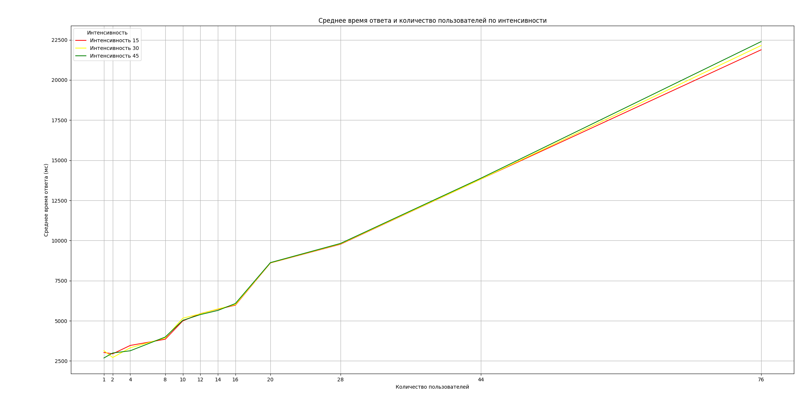
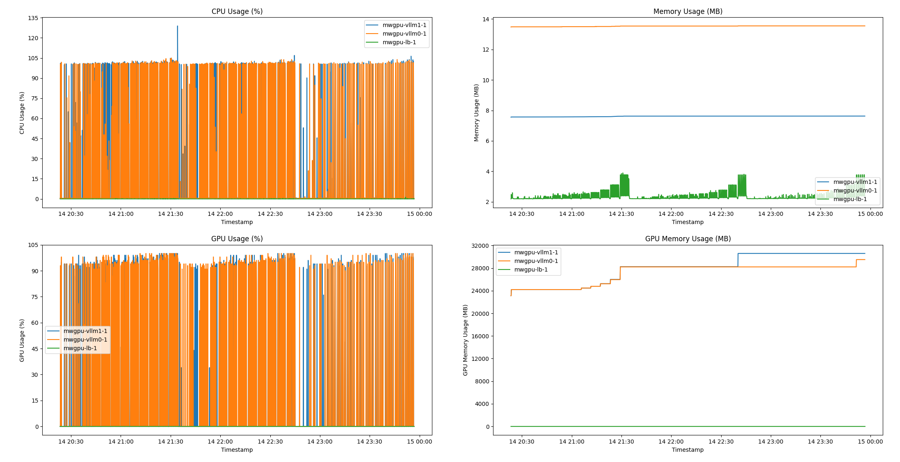
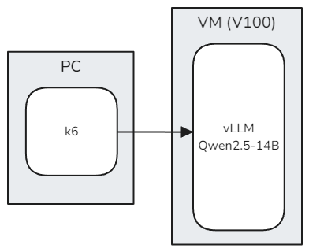
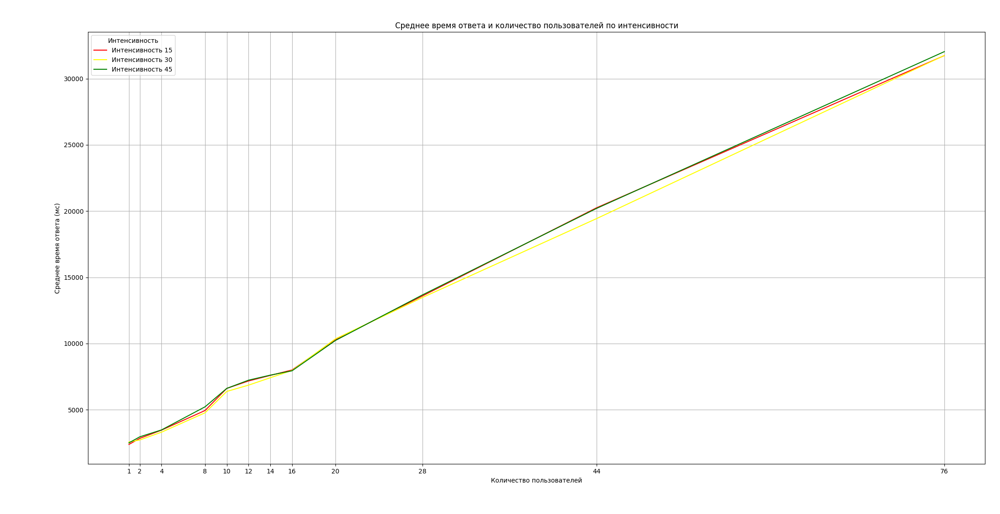
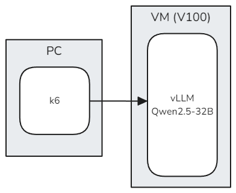
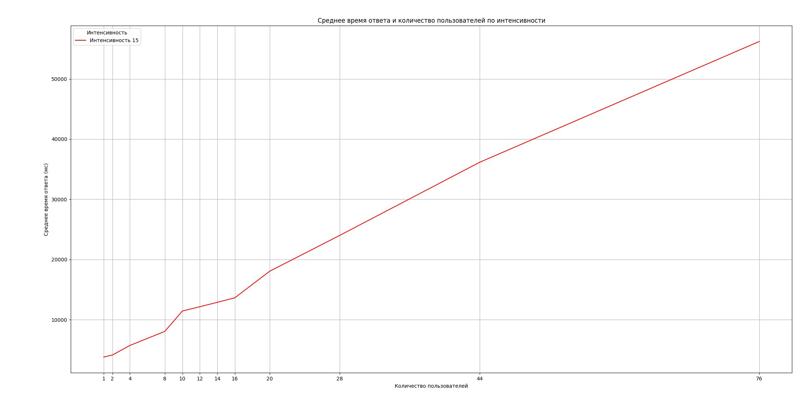

# Нагрузочное тестирование

Отправка [вопросов](questions/llm-prompt.csv) с информацией о документах с промптом напрямую к LLM запущенную в vLLM.

Тест запускается с разной интенсивностью (время между запросами от одно пользователя): 15, 30 и 45 секунд.

Тест: [vllm-prompt-llm.js](scripts/vllm-prompt-llm.js)

## На одном ядре GPU

Intel Broadwell with NVIDIA® Tesla® V100

| Number of GPUs | VRAM, GB | Number of vCPUs | RAM, GB |
|----------------|----------|-----------------|---------|
| 1              | 32       | 8               | 96      |

### Схема

### Модель

[Qwen/Qwen2.5-14B-Instruct-GPTQ-Int4](https://huggingface.co/Qwen/Qwen2.5-14B-Instruct-GPTQ-Int4)

### Результат

Среднее время ответа:

Потребление ресурсов:

## На двух ядрах GPU

Intel Cascade Lake with NVIDIA® Tesla® V100

| Number of GPUs | VRAM, GB | Number of vCPUs | RAM, GB |
|----------------|----------|-----------------|---------|
| 2              | 64       | 16              | 96      |

### С горизонтальным масштабированием

Запуск двух vLLM на каждое ядро.

#### Схема

#### Модель

[Qwen/Qwen2.5-14B-Instruct-GPTQ-Int4](https://huggingface.co/Qwen/Qwen2.5-14B-Instruct-GPTQ-Int4)

#### Результат

Среднее время ответа:

Потребление ресурсов:

### С вертикальным масштабированием

Запуск одного vLLM на двух ядрах.

#### Схема

#### Модель

[Qwen/Qwen2.5-14B-Instruct-GPTQ-Int4](https://huggingface.co/Qwen/Qwen2.5-14B-Instruct-GPTQ-Int4)

#### Результат

Среднее время ответа:

### С вертикальным масштабированием + модель на 32B

Запуск одного vLLM на двух ядрах.

#### Схема

#### Модель

[Qwen/Qwen2.5-32B-Instruct-GPTQ-Int4](https://huggingface.co/Qwen/Qwen2.5-32B-Instruct-GPTQ-Int4)

#### Результат

Среднее время ответа:

