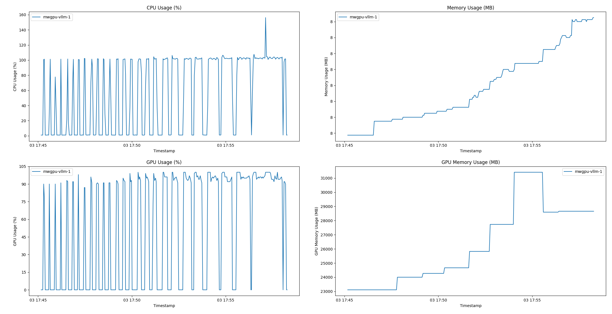

# Нагрузочное тестирование

## Запросы ответов на вопросы

Сценарий: каждый пользователь задает вопрос после 15 секунд "прочтения" ответа на предыдущий вопрос
(среднее время прочтения человеком текста ответа)

Запускается на разном кол-ве пользователей: 1 2 4 8 12 24 32

### ВМ

Intel Broadwell with NVIDIA® Tesla® V100 (gpu-standard-v1)

| Number of GPUs | VRAM, GB | Number of vCPUs | RAM, GB |
|----------------|----------|-----------------|---------|
| 1              | 32       | 8               | 96      |

### Результаты

#### LLM

Запросы:


Ресурсы:


#### VLM

Запросы:


Ресурсы:


## Запросы однострочные напрямую к модели (VLLM)

Однострочные вопросы на разные темы.

Запросы:


Ресурсы:


## Запросы однострочные к модели (VLLM) через сервис (rag)

Однострочные вопросы на разные темы.

Видно как увеличивается время работы, когда rag выступает по сути прокси для vllm.

Запросы:


Ресурсы:


## Запросы с prompt напрямую к модели (VLLM)

Запрос с prompt по документу.

Запросы:


Ресурсы:



## Запуск

Сначала запускается скрипт сбора статистики потребления ресурсов на ВМ, дальше на ПК запускаются k6 тесты.
После завершения тестов, скрипт сборка статистики завершается.

### На ВМ

```shell
./stats.sh
```

### На ПК

Для LLM:

```shell
./runner-llm.sh
```

Для VLM:

```shell
./runner-vlm.sh
```

## Вопросы

Списки вопросов в [questions](questions):

- для LLM - [llm.csv](questions/llm.csv)
- для VLM - [vlm.csv](questions/vlm.csv)

## Отчеты

Результаты работы k6 в [reports](reports).

## Графики

Построить графики для LLM:

```shell
python plot.py reports/llm
python plot-stats.py reports/llm/stats.csv
```

Построить графики для VLM:

```shell
python plot.py reports/vlm
python plot-stats.py reports/vlm/stats.csv
```
